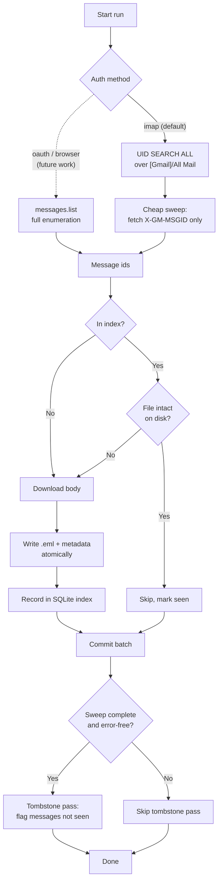

# Gmail Archiver

Archive every message in a Gmail account to local `.eml` files, on demand.

Built around one guarantee: **once a message is archived, it stays archived** —
including after it is deleted from Gmail. Re-runs never re-download what they
already have, and mail that disappears upstream is flagged, never removed.

> **Proprietary.** All rights reserved. See [LICENSE](LICENSE).

---

## Contents

- [What it does](#what-it-does)
- [How it works](#how-it-works)
- [Prerequisites](#prerequisites)
- [Installation](#installation)
- [Authentication](#authentication)
- [How to Run](#how-to-run)
- [On-disk format](#on-disk-format)
- [Deleted mail and tombstones](#deleted-mail-and-tombstones)
- [Recovering from a lost index](#recovering-from-a-lost-index)
- [Future iterations](#future-iterations)
- [How to Test](#how-to-test)
- [How to Delete / Uninstall](#how-to-delete--uninstall)
- [Assumptions](#assumptions)

---

## What it does

| Capability | Behavior |
|---|---|
| **Full download** | Every message is written as a byte-for-byte `.eml` plus a JSON metadata sidecar. |
| **Deduplication** | A SQLite index keyed by the Gmail permanent message id. A re-run downloads nothing it already holds. |
| **New-mail detection** | Every run sweeps the whole mailbox and skips what is indexed. There is no timestamp watermark that can advance past mail you never downloaded. |
| **Self-healing** | Before skipping an indexed message, its file is checked on disk. A missing or truncated `.eml` is re-downloaded. |
| **Preserves deleted mail** | Archived messages are never removed. When one disappears from Gmail it is flagged with a `vanished_at` timestamp. |
| **Crash safety** | Every write is atomic (temp file → `fsync` → rename). An interrupted run costs only the messages it had not reached. |
| **Read-only by default** | Backup selects IMAP folders read-only and fetches with `BODY.PEEK[]`; the OAuth path requests `gmail.readonly`. It cannot alter or delete your mail. |
| **Backs up over IMAP** | An app password is all you need — no Google Cloud project. This is the default and the supported path; the API backend is [future work](#future-iterations). |
| **Restore** | Secondary. Requires OAuth and authenticates separately with its own write-scoped token — see [Future iterations](#future-iterations). |

---

## How it works



The tombstone pass is deliberately skipped after a partial or error-bearing
sweep. A run that was cut short has not *seen* the messages it never reached,
and flagging on that basis would mark the whole archive as vanished.

---

## Prerequisites

| Requirement | Version |
|---|---|
| Operating system | macOS, Linux, or Windows |
| Python | **3.10+** (developed and tested on 3.14) |
| [`uv`](https://docs.astral.sh/uv/) | 0.5+ |
| Gmail account | With an app password and IMAP enabled |

External services: the Gmail IMAP endpoint (`imap.gmail.com:993`) or the Gmail
API. No database server is required — the index is a local SQLite file.

Disk: budget slightly more than your Gmail storage usage. `.eml` files are
stored uncompressed.

---

## Installation

```bash
git clone git@github.com:junxit/gmail-archiver.git
cd gmail-archiver

# Create the virtualenv and install from the lockfile
uv sync

# Include the test dependencies
uv sync --extra dev
```

Verify:

```bash
uv run gmail-archiver --version
```

---

## Authentication

**IMAP with a Gmail app password is the default and the supported path.** It
needs no Google Cloud project, and it is the configuration this tool is built
and tested around. The API-based methods exist in the code but are not the
supported route yet — see [Future iterations](#future-iterations).

### IMAP app password — the supported path

1. Enable 2-Step Verification on the Google account.
2. Create an app password at <https://myaccount.google.com/apppasswords>.
3. Enable IMAP in Gmail: Settings → Forwarding and POP/IMAP → Enable IMAP.

Supply the credentials through the environment, never on the command line:

```bash
export GMAIL_ARCHIVER_EMAIL='you@gmail.com'
export GMAIL_ARCHIVER_APP_PASSWORD='xxxx xxxx xxxx xxxx'

uv run gmail-archiver backup
```

If neither the environment variable nor `--app-password` is set, the tool
prompts interactively. The app password is never written to disk.

> `--app-password` still works but is deprecated: an argv value is readable by
> any other user on the machine via `ps` and is written to your shell history.

### Where credentials are stored

Only the OAuth paths persist anything:

| File | Purpose | Permissions |
|---|---|---|
| `~/.gmail-archiver/token.json` | Read-only backup token (OAuth paths only) | `0600` in a `0700` directory |
| `~/.gmail-archiver/token-restore.json` | Write-scoped restore token | `0600` in a `0700` directory |

---

## How to Run

```bash
# Back up. IMAP is the default, so no --auth-method is needed.
uv run gmail-archiver backup

# Try it on a small slice first
uv run gmail-archiver backup --backup-dir /tmp/ga-test --max-results 50

# See what the archive holds
uv run gmail-archiver status
uv run gmail-archiver status --list-vanished --list-failures

# Rebuild the index from the archive itself
uv run gmail-archiver rebuild-index

# Restore into Gmail. Restore writes to the mailbox, which IMAP cannot do,
# so it uses OAuth and authenticates separately from backup.
uv run gmail-archiver restore --auth-method oauth --client-secrets ~/client_secrets.json
```

Global options work either before or after the subcommand.

### Commands

| Command | Purpose |
|---|---|
| `backup` | Download new mail and refresh the index. |
| `status` | Print counts, total size, vanished messages, pending retries. |
| `rebuild-index` | Reconstruct the SQLite index by walking `metadata/` and re-hashing the `.eml` files. |
| `restore` | Import archived messages back into Gmail. |

### Key options

| Option | Default | Notes |
|---|---|---|
| `--backup-dir` | `~/gmail-backup` | Where the archive lives. |
| `--auth-method` | `imap` | `imap` is the supported path. `oauth`/`browser` are future work. |
| `--folder` | `[Gmail]/All Mail` | IMAP only. The name varies by account language. |
| `--index-db` | `<backup-dir>/index.db` | SQLite index location. |
| `--batch-size` | `100` | Messages between index commits. |
| `--max-results` | all | Cap on *new* downloads this run. |
| `--no-verify-existing` | off | Skip the on-disk size check. Faster, but damage goes unnoticed. |
| `--log-level` | `INFO` | `DEBUG` also prints tracebacks. |

### Exit codes

| Code | Meaning |
|---|---|
| `0` | Completed with no errors. |
| `1` | Fatal error (auth failure, unreadable index, connection lost with no recovery). |
| `2` | Completed, but some messages failed. They are queued for retry — see `status --list-failures`. |
| `130` | Interrupted. Progress is saved; re-run to continue. |

A scheduled run should treat anything other than `0` as needing attention.

---

## On-disk format

```
~/gmail-backup/
├── emails/
│   └── 2024/                  # year (UTC)
│       └── 01/                # month (UTC)
│           └── <id>_<hash8>_<subject>.eml
├── metadata/
│   └── <id>.json
└── index.db                   # SQLite dedup index (+ -wal, -shm)
```

Metadata sidecar:

```json
{
  "message_id": "1234567890123456789",
  "thread_id": "1234567890123456789",
  "subject": "Example",
  "from": "sender@example.com",
  "to": "you@gmail.com",
  "date": "Mon, 1 Jan 2024 12:00:00 +0000",
  "labels": ["INBOX", "IMPORTANT"],
  "internal_date": "1704110400000",
  "size": 4096,
  "sha256": "…",
  "backup_path": "emails/2024/01/…eml",
  "backup_time": "2024-01-02T09:15:00+00:00"
}
```

Both backends write the identical format, so an IMAP-made archive is restorable
by the API-based restore.

### IMAP label caveats

IMAP exposes less than the API does. Unavoidable differences:

| Aspect | Behavior |
|---|---|
| System labels | Mapped to the API's ids (`\Inbox`→`INBOX`, `\Sent`→`SENT`, `\Important`→`IMPORTANT`, `\Starred`→`STARRED`, `\Draft`→`DRAFT`, `\Trash`→`TRASH`, `\Junk`/`\Spam`→`SPAM`). |
| `UNREAD` | Synthesized from the IMAP `\Seen` flag, mirroring the API. |
| User labels | Stored by display name, since IMAP exposes names rather than `Label_NNN` ids. Restoring them is therefore best-effort. |
| Categories | `CATEGORY_*` is not exposed over IMAP and is absent. |
| Read state | Never modified — folders are selected read-only and bodies fetched with `BODY.PEEK[]`. |

---

## Deleted mail and tombstones

Archived `.eml` files are **never deleted by this tool**. When a message the
archive holds stops appearing in Gmail, its index row gets a `vanished_at`
timestamp:

```bash
uv run gmail-archiver status --list-vanished
```

If the message reappears, the flag clears automatically.

### The limitation you should know about

`[Gmail]/All Mail` **excludes Trash and Spam**. So the guarantee is:

> Any message archived at least once is kept forever, and you get a record of
> when Gmail stopped showing it.

A message deleted in the window *between two runs*, before it was ever archived,
is not captured. Running frequently keeps that window small. To close it, add
the Trash and Spam folders as additional runs:

```bash
uv run gmail-archiver backup --auth-method imap --folder '[Gmail]/Trash'
uv run gmail-archiver backup --auth-method imap --folder '[Gmail]/Spam'
```

Both write into the same archive and index, so deduplication still holds.

---

## Recovering from a lost index

The index is a cache, not the archive. Every column is re-derivable from the
`metadata/` sidecars and the `.eml` bytes:

```bash
uv run gmail-archiver rebuild-index --backup-dir ~/gmail-backup
```

An archive made by an older version with a `backup_state.json` is migrated
automatically on first run; the old file is renamed to
`backup_state.json.migrated`.

---

## Future iterations

These paths exist in the code and are exercised by the test suite, but they are
**not the supported route today**. Treat them as work in progress.

### API-based backup (`--auth-method oauth` / `--auth-method browser`)

The Gmail API backend is implemented and shares the same index, on-disk format,
deduplication, self-healing and tombstone logic as the IMAP path. It is not the
default because it asks more of you for no benefit at present:

| Method | Status | Blocker |
|---|---|---|
| `--auth-method oauth` | Works, unsupported | Requires you to create a Google Cloud project and a Desktop OAuth client, then keep `client_secrets.json` around. |
| `--auth-method browser` | **Not usable** | No OAuth client is bundled. Shipping a real client secret in a public repository would let anyone impersonate this application, so `BUNDLED_CLIENT_CONFIG` is deliberately left as placeholders. It exits with instructions rather than half-working. |

What the API path would eventually buy, and why it may be worth finishing:

- **`users.history.list`** for genuine incremental sync, including detection of
  label changes on messages already archived — something IMAP cannot report.
- **`includeSpamTrash=True`**, which would close the Trash/Spam gap described
  under [Deleted mail and tombstones](#deleted-mail-and-tombstones) in a single
  sweep rather than extra per-folder runs.
- **Real label ids** (`Label_NNN`) instead of display names, which would make
  user labels restore reliably.

### Restore

Restore is functional but secondary, and it is the one place OAuth is required
today: Gmail offers no IMAP equivalent of `messages.import`. It authenticates
separately from backup and stores its write-scoped token in its own file, so
your day-to-day archiving credential never gains write access.

```bash
uv run gmail-archiver restore --auth-method oauth --client-secrets ~/client_secrets.json
```

---

## How to Test

```bash
uv sync --extra dev
uv run pytest
```

With coverage:

```bash
uv run pytest --cov=gmail_archiver --cov-report=term-missing
```

The suite is fully offline — the Gmail API and the IMAP server are mocked, and
no real credentials are used.

Audit dependencies for published advisories:

```bash
uvx pip-audit
```

---

## How to Delete / Uninstall

```bash
# Remove Python cache files
find . -type d -name "__pycache__" -exec rm -rf {} + 2>/dev/null
find . -type f -name "*.pyc" -delete
find . -type f -name "*.pyo" -delete

# Remove virtual environments
rm -rf .venv venv ENV .uv

# Remove build artifacts
rm -rf build dist *.egg-info .eggs

# Remove test/coverage artifacts
rm -rf .pytest_cache .coverage htmlcov .tox
```

Remove stored credentials (revoke the app password at
<https://myaccount.google.com/apppasswords> as well):

```bash
rm -rf ~/.gmail-archiver
```

**Delete the archive itself.** This is irreversible and destroys your only copy
of any mail already removed from Gmail — check `status --list-vanished` first:

```bash
rm -rf ~/gmail-backup
```

---

## Assumptions

- **The archive lives outside the repository.** `~/gmail-backup` by default.
  `.gitignore` also covers `*.eml`, `emails/`, `metadata/`, `*.db` and the
  credential filenames, so pointing `--backup-dir` at a working copy still
  cannot commit mail.
- **Message identity** is the Gmail permanent id (`X-GM-MSGID` over IMAP, the
  message id over the API). If neither is available, the RFC822 `Message-ID`
  header is the fallback — it is sender-controlled, so it is sanitized before
  it is used as a path component.
- **Directory bucketing is UTC**, so the layout does not shift with the
  machine's timezone. Messages archived by versions before 0.2.0 keep their
  original path; they are not re-filed.
- **Single run at a time** per backup directory. There is no inter-process lock;
  two concurrent runs against one archive are not supported.
- **Attachments are inline.** Messages are buffered whole in memory, and the
  Gmail API caps a raw message at roughly 35 MB.
- **Restore is secondary.** It is not exercised as heavily as backup, and
  re-importing into an account that still holds the messages will duplicate
  them — Gmail's import does not deduplicate server-side.
- **`python-dotenv`, `tqdm`, `python-dateutil` and `pytest-mock` were declared
  but never imported**, and have been dropped.
